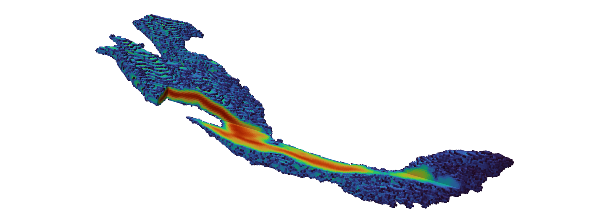

# gpkde
Fortran Code for Grid Projected Kernel Density Estimation of Discrete Particle Distributions
[](https://github.com/upc-ghs/gpkde/actions/workflows/ci.yml)



## Overview
The program performs Grid Projected Kernel Density Estimation (GPKDE) of a discrete dataset in one, two or three dimensional domains and is parallelized with the OpenMP library. 

It works as a standalone software by reading an input simulation file, which configures the loading of a source file with data points and additional parameters for defining the reconstruction grid and the optimization for bandwidth selection.

## Command line interface
Some basic command line arguments have been implemented in order to control program execution. These can be requested as help with the instruction ``gpkde --help`` or ``gpkde -h``, which displays the following message in console:
 
```
GPKDE version *.*.*               
Program compiled Apr 12 2023 19:44:24 with GFORTRAN compiler (ver. *.*.*)       

Fortran code for Grid Projected Kernel Density Estimation of discrete particle distributions

usage:

  gpkde [options] simfile

options:

  -h         --help                Show this message                             
  -l  <str>  --logname    <str>    Write program logs to <str>                   
  -nl        --nolog               Do not write log file                         
  -np <int>  --nprocs     <int>    Run with <int> processes                      
  -p         --parallel            Run in parallel                               
  -v         --version             Show program version                          

For bug reports and updates, follow:                                             
  https://github.com/upc-ghs/gpkde    
```

## Simulation file
For details about the configuration of input files please refer to the program [Documentation](doc/gpkde_IO_100.pdf). 

## Examples 
A set of possible use cases of the reconstruction module are included as example files in this repository. The currently available simulations include:

- [1D Gaussian distribution](examples/ex01_1dnormal/)
- [2D Heterogeneous distribution](examples/ex02_2dhet/)
- [3D Heterogeneous distribution](examples/ex03_3dhet/)

## Compilation 
Repository includes two makefiles at the folder `make`:

- `Makefile`: for the `gfortran` compiler, with compilation verified for `gfortran>=8.4.0`.
- `Makefile-ifort`: for the `ifort` compiler, with compilation verified for `ifort@2021.9.0`.

For users familiarized with Visual Studio, the folder `msvs` contains the project/solution files, and a Windows binary/executable is available at the folder `bin/`.

## License
MIT License

## Resources
* [gfortran](https://gcc.gnu.org/wiki/GFortran)
* [OpenMP](https://www.openmp.org/)
* [Intel oneApi HPC toolkit](https://www.intel.com/content/www/us/en/developer/tools/oneapi/hpc-toolkit.html)
* [MIT License](https://mit-license.org/)
