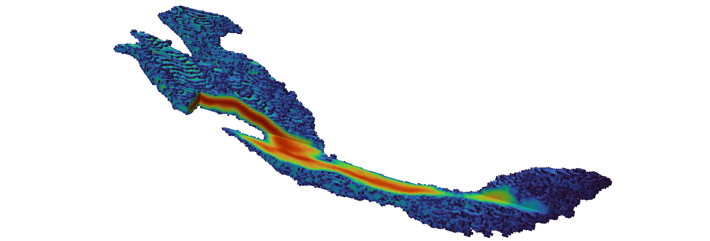

# gpkde
Fortran Code for Grid Projected Kernel Density Estimation of Discrete Particle Distributions
[](https://github.com/upc-ghs/gpkde/actions/workflows/ci.yml)



## Overview
The program performs Grid Projected Kernel Density Estimation (GPKDE) of a discrete dataset in one, two or three dimensional domains and is parallelized with the OpenMP library. 

It works as a standalone program by reading an input simulation file, which configures the loading of a source file with data points and additional parameters for defining the reconstruction grid and the optimization for bandwidth selection.

## Build

### Get the code
Clone the repository

```
git clone https://github.com/upc-ghs/gpkde.git
```

### Makefile
Repository includes two makefiles at the folder `make`:

- `Makefile`: for the `gfortran` compiler, with compilation verified for `gfortran>=8.4.0`.
- `Makefile-ifort`: for the `ifort` compiler, with compilation verified for `ifort@2021.9.0`.

**Note**: The preprocessor variable ``-DREAL32`` can be added to the compiler flags in order to build with single precision floating point. Compilation via makefiles create the folder `make/objtemp`. It is recommended to remove this folder while developing source code or integrating program changes for a consistent compilation.

### Meson
The project can also be built with the [meson](https://mesonbuild.com/) build system:

- Setup the project configuration

```
    meson setup builddir -Ddebug=false --prefix=$(pwd) --libdir=bin
``` 
- Compile 

```
    meson install -C builddir
```

- Basic tests

```
    meson test --verbose --no-rebuild -C builddir
```

**Note**: For building with single precision floating point, the option ``--Dreal32=true`` can be given to the setup instruction. 

### Visual Studio and Windows
The folder `msvs` contains the project and solution files verified for Visual Studio 2019 and 2022 on a Windows system. An executable file and complementary `dll`'s providing the OpenMP library are available at the folder `wbin/`. Users can make easy use of these files at a system level by extending the `PATH` environment variable, adding their specific address to the `wbin/` folder (as [here](https://www.itprotoday.com/windows-server/how-can-i-add-new-folder-my-system-path) or [here](https://windowsloop.com/how-to-add-to-windows-path/)).

The necessary `dll`'s can also be installed from the Intel and Visual Studio redistributables (`x64`), respectively:

 - [Intel Fortran Compiler Runtime for Windows](https://www.intel.com/content/www/us/en/developer/articles/tool/compilers-redistributable-libraries-by-version.html) 
 - [Microsoft Visual C++ Redistributable](https://learn.microsoft.com/en-US/cpp/windows/latest-supported-vc-redist?view=msvc-170)


**Note**: The windows executable `gpkdesp.exe` is built with single precision floating point (`/DREAL32`) which requires less memory specially for large three dimensional problems. This option is enabled by default in the Visual Studio solution/project files and can be disabled at Configuration Manager by leaving empty the field `Project>Properties>Fortran>Preprocessor>Preprocessor Definitions`. The executable `gpkde.exe` is built with double precision floating point.


## Command line interface
Some basic command line arguments have been implemented in order to control program execution. These can be requested as help with the instruction ``gpkde --help`` or ``gpkde -h``, which displays the following message in console:
 
```
GPKDE version *.*.*               
Program compiled Apr 12 2023 19:44:24 with GFORTRAN compiler (ver. *.*.*)       

Fortran code for Grid Projected Kernel Density Estimation of discrete particle distributions

usage:

  gpkde [options] simfile

options:

  -h         --help                Show this message                             
  -l  <str>  --logname    <str>    Write program logs to <str>                   
  -nl        --nolog               Do not write log file                         
  -np <int>  --nprocs     <int>    Run with <int> processes                      
  -p         --parallel            Run in parallel                               
  -v         --version             Show program version                          

For bug reports and updates, follow:                                             
  https://github.com/upc-ghs/gpkde    
```

## Simulation file
For details about the configuration of input files please refer to the program [Documentation](doc/gpkde_IO_v100.pdf). 

## Examples 
A set of possible use cases of the reconstruction module are included as example files in this repository. The currently available simulations include:

- [1D Gaussian distribution](examples/ex01_1dnormal/)
- [2D Heterogeneous distribution](examples/ex02_2dhet/)
- [3D Heterogeneous distribution](examples/ex03_3dhet/)

## License
MIT License

## Resources
* [gfortran](https://gcc.gnu.org/wiki/GFortran)
* [OpenMP](https://www.openmp.org/)
* [Intel oneApi HPC toolkit](https://www.intel.com/content/www/us/en/developer/tools/oneapi/hpc-toolkit.html)
* [MIT License](https://mit-license.org/)
